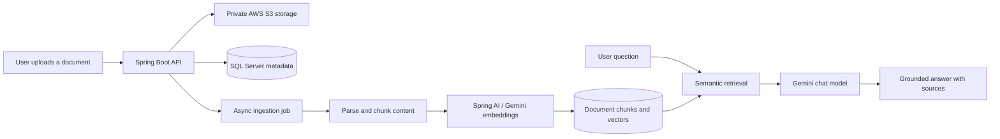

# AetherDocs

> An AI-powered document workspace for storing, organising, sharing, and querying learning materials with Retrieval-Augmented Generation (RAG).

**Academic capstone project · Team of 4**

AetherDocs helps students keep study materials in one place, then ask grounded questions over selected documents or their personal document library. The backend provides secure document storage, asynchronous ingestion, semantic retrieval, AI chat with sources, and supporting collaboration and subscription features.

## Highlights

- Store documents and avatars in private AWS S3 storage.
- Organise documents with folders, tags, favourites, filters, trash, and restore actions.
- Share documents through public visibility, share links, and direct sharing with friends.
- Process uploaded documents asynchronously: extract text, chunk content, generate embeddings, and index it for retrieval.
- Ask questions over one document, selected documents, or a user's document library.
- Return source metadata for RAG responses so the client can show where an answer came from.
- Authenticate users with email/OTP, Google OAuth2, JWT access tokens, refresh-token rotation, logout, and password reset.
- Support subscription plans and VNPay payment flows.
- Provide admin APIs for user and payment management.

## My Contribution

I focused on the document storage and AI/RAG capabilities:

- Implemented private document and avatar storage with **AWS S3**, while persisting metadata in **SQL Server**.
- Built the document ingestion flow: upload, text extraction, chunking, embedding generation, and document readiness states.
- Integrated **Spring AI** with Gemini for embedding and document-grounded RAG chat.
- Implemented semantic retrieval with cosine similarity and returned source references with chat responses.

## RAG Flow



Documents move through these ingestion states:

```text
UPLOADED → PARSING → INDEXING → READY
                         └────→ FAILED
```

Only authorised documents in the `READY` state can be used for chat.

## Tech Stack

| Area | Technologies |
| --- | --- |
| Language & framework | Java 26, Spring Boot 4, Spring MVC |
| Security | Spring Security, JWT, BCrypt, OAuth2 Google Login |
| Data | SQL Server, Spring Data JPA, Flyway |
| AI | Spring AI, Google Gemini Chat, Gemini Embeddings |
| File storage | AWS S3 with private objects and presigned access URLs |
| Document processing | Apache PDFBox, Apache POI, optional Docling and Tesseract OCR |
| API documentation | Springdoc OpenAPI / Swagger UI |
| Payments | VNPay |
| Testing | JUnit 5, Mockito, H2 for tests |

## API Modules

| Module | Main capabilities |
| --- | --- |
| Authentication | Register, OTP verification, login, Google OAuth2, refresh token, logout, password reset |
| Documents | Upload, folders, tags, search/filter, favourites, trash, sharing, public documents |
| AI Chat | Single-document chat, multi-document chat, persistent chat sessions, source references |
| Users & collaboration | Profile, settings, avatar upload, friend requests, friendships |
| Subscriptions | Plans, entitlements, VNPay purchase flow, payment history |
| Administration | User status management and payment overview |

The complete API contract is available in [API_CONTRACT.md](API_CONTRACT.md).

## Getting Started

### Prerequisites

- JDK 26
- SQL Server
- AWS S3 bucket and AWS credentials for file storage
- Gemini API keys for AI chat and embeddings
- Maven Wrapper included in this repository

### Configure environment variables

Use [.env.example](.env.example) as a checklist for local configuration.

At minimum, configure:

```text
SQLSERVER_DATASOURCE_URL
SQLSERVER_DATASOURCE_USERNAME
SQLSERVER_DATASOURCE_PASSWORD
APP_JWT_SECRET
```

Configure the relevant integrations to use their features:

```text
AWS_ACCESS_KEY_ID
AWS_SECRET_ACCESS_KEY
AWS_REGION
AWS_S3_BUCKET_NAME

GEMINI_CHAT_API_KEY
GEMINI_EMBEDDING_API_KEY

MAIL_USERNAME
MAIL_PASSWORD
GOOGLE_CLIENT_ID
GOOGLE_CLIENT_SECRET
```

> Do not commit real credentials, JWT secrets, cloud keys, or payment secrets. The application reads configuration from environment variables; `.env.example` is only a template.

### Run locally

```bash
git clone https://github.com/longnb47/SWP391-SE1908-GROUP-01.git
cd SWP391-SE1908-GROUP-01
```

Windows PowerShell:

```powershell
.\mvnw.cmd spring-boot:run
```

macOS/Linux:

```bash
./mvnw spring-boot:run
```

The API runs at:

```text
http://localhost:8080
```

Swagger UI:

```text
http://localhost:8080/swagger-ui/index.html
```

## Run Tests

Windows PowerShell:

```powershell
.\mvnw.cmd test
```

macOS/Linux:

```bash
./mvnw test
```

## Project Structure

```text
src/
├── main/
│   ├── java/com/se1908/group01/
│   │   ├── config/        # Security, S3, AI, Swagger, payment configuration
│   │   ├── controller/    # REST API endpoints
│   │   ├── dto/           # Request and response models
│   │   ├── entity/        # JPA entities
│   │   ├── repository/    # Database access
│   │   ├── security/      # JWT and OAuth2 security flow
│   │   └── service/       # Business logic, ingestion, RAG, storage
│   └── resources/
│       ├── application.yaml
│       └── db/migration/  # Flyway migrations
├── API_CONTRACT.md
└── .env.example
```

## Security and Privacy Notes

- Uploaded documents and avatars are stored as private S3 objects.
- File preview and download access are generated through controlled presigned URLs.
- Protected API endpoints require JWT authentication.
- Chat retrieval is scoped to documents the current user is authorised to access.
- RAG prompts are designed to answer from retrieved document context rather than unrestricted general knowledge.
